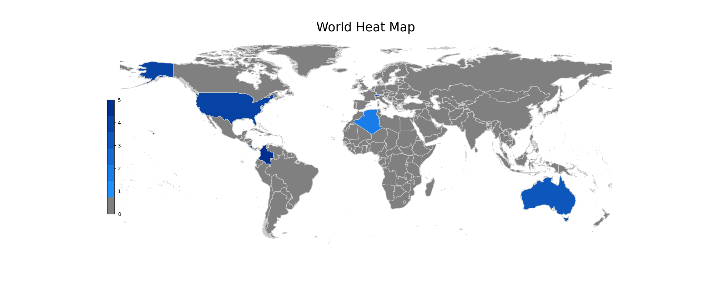

# World Heat Map PNG Generator
> This repository contains a python script to generate a world heat map based on the data from a CSV files. The purpose of this file could be to quickly visualize various data by geographical perspective.

> Two sample files are provided. One to visualize revenue over time, aggregated by country; and a second to visualize the population of a workforce across the globe.

## Usage
### Prepare Data
Create a CSV file that meets the following two requirements:
1. There is a column 'code' with the two letter abbreviation for each country.
2. There is a single numeric field to plot with the heat map. This needs to be named 'value'.

### Generate Heat Map PNG
Open terminal and move to the directory with the repository (using _cd path/to/repository_). Next, run the python file _word_frequency.py_.
  ```
  python word_frequency.py file_name.csv
  ```
  One of our sample data files contains employee roster, each row representing a value of 1 employee.
  Utilizing the follow group by, we can sum the count of employees by country code:
  ```
  df.groupby(['code']).agg({'value':'sum'}).reset_index()
  ```
  The CSV data now looks like:
  ```
  code, value
  CO, 5
  US, 4
  AU, 3
  CH, 3
  CR, 3
  DZ, 2
  ``` 
Once the file finishes, running - you will see a new PNG file created. This contains the output heat map. 
See below for the example PNG from our employee workforce sample data.
